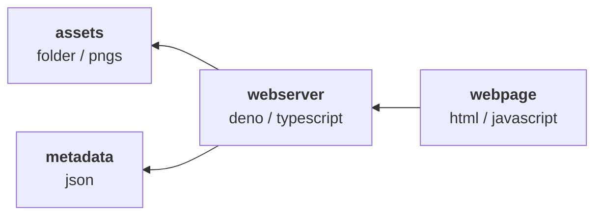

# 🏷️ Tagstures - POC
A simple proof of concept dev tool to manage large quantities of textures with tags and collection mappings

> 🚧 This is a simple POC created in a day with the help of ChatGPT. Future versions might use quite different technologies. Especially for performance and expandability.

## Features

Current features implemented in the current concept state

- Tag and collection metadata for all images in `assets`
- Adding and removing metadata
    - Select multiple rows to edit all
- Filter by tags and file name
- Hover over preview to display a bigger version

## Resources

All resources used for this project

- [VS Code](https://code.visualstudio.com/) - Code Editor
- [Deno](https://deno.com/) - Runtime
    - [Deno - VS Code extension](https://marketplace.visualstudio.com/items?itemName=denoland.vscode-deno)
- [Bootstrap](https://getbootstrap.com/) - Styling
- [ChatGPT](https://chatgpt.com/) - Speed and frustration

## Architecture

## Setup

Simple steps to setup the project

1. Clone the repository
2. Open repository in VS Code
3. Open terminal in VS Code
4. Run PowerShell command to install Deno `irm https://deno.land/install.ps1 | iex`
5. Install VS Code extension for Deno
6. Place images inside `assets`-folder
7. Start local webserver with `deno task start`

    > ⚠️ The webserver uses **net** as well as **file read** and **write** permissions! 

8. Open webpage URL from console
